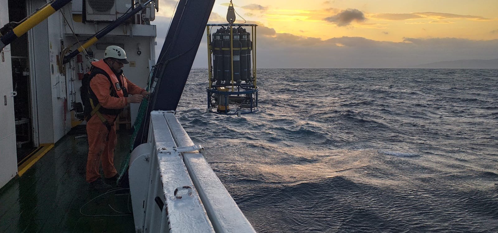

<div align="center">



# 🌊 GIFT Oceanographic Intelligence Platform

[](https://susafle-gift-dashboard-panelappmain-2bx2qd.streamlit.app/)
[](https://www.python.org/downloads/)
[](https://opensource.org/licenses/MIT)

**A comprehensive Business Intelligence Dashboard for marine science**

*Transforming oceanographic data from the Gibraltar Fixed Time Series (GIFT) Network into actionable insights*

</div>

---

## 📖 Overview

<div align="justify">

The GIFT Oceanographic Intelligence Platform is an interactive web-based dashboard built with Streamlit that provides advanced visualization and analysis tools for oceanographic data collected in Gibraltar Fixed Time Series (GIFT) monitoring network located in the Strait of Gibraltar. This platform enables researchers to explore physical and biogeochemical properties of Atlantic and Mediterranean water masses.

</div>

### 🎯 Key Features

- **🗺️ Interactive Station Mapping**: Geospatial visualization of all GIFT sampling stations
- **📊 Executive Dashboard**: Comprehensive KPIs and summary statistics
- **🌡️ Physical Oceanography and Biogeochemistry Analysis**:
  - T-S Diagrams (Temperature-Salinity)
  - Water mass classification (Atlantic Inflow, Mediterranean Outflow Water, Atlantic Mediterranean Interface)
  - Vertical profile analysis
- **📈 Temporal Analysis**: Annual trends with linear regression and seasonal patterns
- **🔗 Correlation Analysis**: Variable relationships and interaction patterns
- **✅ Data Quality Control**: Automated outlier detection and validation
- **📚 Publications**: Comprehensive list of scientific publications from the GIFT Network data

## 🚀 Live Demo

<div align="center">

### **[🌐 Access the Live Application](https://susafle-gift-dashboard-panelappmain-2bx2qd.streamlit.app/)**

</div>

## 📸 Platform Features

### 🌊 Water Mass Classification
Analysis of **Atlantic Inflow**, **Mediterranean Outflow Water**, and **Atlantic Mediterranean Interface** based on salinity thresholds.

### 🗺️ Interactive Mapping
Geospatial visualization of sampling stations across the Strait of Gibraltar.

### 📊 Advanced Analytics
Real-time data analysis with T-S diagrams, correlation matrices, and temporal trend analysis.

## 🏗️ Architecture

<div align="justify">

Built on a **4-tier architecture**:

1. **Presentation Layer**: Streamlit UI with interactive components
2. **Business Logic Layer**: Analytics & oceanographic computations
3. **Data Processing Layer**: Data transformations and filtering
4. **Data Storage Layer**: Data loading with caching optimization

</div>

## 🛠️ Technology Stack

- **Framework**: [Streamlit](https://streamlit.io/)
- **Visualization**: Plotly, Seaborn, Matplotlib
- **Data Analysis**: Pandas, NumPy, SciPy
- **Geospatial**: Plotly Maps
- **UI Components**: streamlit-option-menu

## 📊 Data Source

<div align="justify">

**GIFT Network (Gibraltar Fixed Time Series)**
- 865+ oceanographic measurements
- 37 oceanographic parameters
- Multi-year temporal coverage (2005-2024)
- Multiple research vessels and campaigns

### Water Mass Classification Criteria

- **Atlantic Inflow**: Salinity < 37.0
- **Mediterranean Outflow Water**: Salinity > 37.5
- **Atlantic Mediterranean Interface**: 37.0 ≤ Salinity ≤ 37.5

</div>

## 🔧 Installation

### Prerequisites

- Python 3.8 or higher
- pip package manager

### Local Setup

1. **Clone the repository**
```bash
git clone https://github.com/susafle/GIFT_DASHBOARD.git
cd GIFT_DASHBOARD/panel
```

2. **Create and activate virtual environment**
```bash
python -m venv venv
source venv/bin/activate  # On Windows: venv\Scripts\activate
```

3. **Install dependencies**
```bash
pip install -r requirements.txt
```

4. **Configure data access**

The application loads data from a private Dropbox link. For local development:
- Place `GIFT_database_prepared.csv` in `panel/data/` directory

For Streamlit Cloud deployment:
- Add the Dropbox URL to Streamlit Secrets (see deployment section)

5. **Run the application**
```bash
streamlit run app/main.py
```

The dashboard will open automatically in your browser at `http://localhost:8501`

## 🚀 Streamlit Cloud Deployment

### Configure Secrets for Data Access

The data file is kept private and loaded from Dropbox. To deploy on Streamlit Cloud:

1. **Deploy your app** on Streamlit Cloud
2. **Go to App Settings** → **Secrets**
3. **Add the following secret**:

```toml
dropbox_url = "https://www.dropbox.com/scl/fi/u3c6w7u710rp6a42bm1a1/GIFT_database_prepared.csv?rlkey=6dwgu16a4ygajsjtx1mff4664&dl=1"
```

**Important**: Make sure the URL ends with `dl=1` (not `dl=0`) for direct download.

4. **Save** and the app will automatically reload with access to the data

### Why This Approach?

- ✅ Keeps sensitive data private (not in GitHub)
- ✅ App works both locally (with local file) and in cloud (with Dropbox)
- ✅ Easy to update data: just update the Dropbox file
- ✅ No need to commit large CSV files to repository

## 📁 Project Structure

```
GIFT_EDA/
├── panel/
│   ├── app/
│   │   ├── main.py                 # Main application entry point
│   │   ├── assets/
│   │   │   └── img/                # Images and logos
│   │   ├── config/
│   │   │   └── config.yaml         # Configuration settings
│   │   ├── modules/                # Dashboard modules
│   │   │   ├── executive.py        # Executive dashboard
│   │   │   ├── physical.py         # Physical oceanography
│   │   │   └── temporal.py         # Temporal analysis
│   │   ├── utils/                  # Utility functions
│   │   │   ├── data_loader.py      # Data loading and caching
│   │   │   ├── processors.py       # Data processing
│   │   │   ├── analytics.py        # Analytics functions
│   │   │   └── campaign_analytics.py
│   │   └── components/             # Reusable components
│   │       └── charts.py           # Chart components
│   ├── data/
│   │   └── GIFT_database_prepared.csv
│   ├── requirements.txt
│   └── venv/
├── notebooks/
│   └── eda.ipynb                   # Exploratory Data Analysis
└── README.md
```

## 📖 Usage Guide

### Navigation

The sidebar menu provides access to different analysis modules:

1. **GIFT Stations Location**: View sampling station locations on an interactive map
2. **GIFT Data Overview**: Executive summary with key metrics and water mass distribution
3. **Physical Oceanography & Biogeochemistry**: T-S diagrams and water mass analysis
4. **Correlation Analysis**: Explore relationships between variables
5. **Temporal Analysis**: Analyze trends and seasonal patterns
6. **Data Quality**: Outlier detection and data validation
7. **Publications**: Scientific publications from the GIFT Network
8. **About**: Project information and team

### Key Visualizations

- **T-S Diagrams**: Interactive Temperature-Salinity plots with color-coded variables
- **Water Mass Classification**: Pie charts showing distribution of water masses
- **Correlation Heatmaps**: Variable relationships and interactions
- **Temporal Trends**: Time series with linear regression
- **Vertical Profiles**: Depth-based analysis of oceanographic parameters

## 👥 Team

### GIFT Principal Investigator
**Dr. I. Emma Huertas**
Marine Biogeochemistry
ICMAN-CSIC
📧 emma.huertas@csic.es

### GIFT Coordinator
**Dr. Susana Flecha**
Marine Biogeochemistry & AI
ICMAN-CSIC
📧 susana.flecha@csic.es

[](https://github.com/susafle)
[](https://www.linkedin.com/in/susana-flecha-b5b05a44/)
[](https://orcid.org/0000-0003-2826-5820)

## 📚 Key Publications

1. **Flecha, S. et al.** (2015). Trends of pH decrease in the Mediterranean Sea through high frequency observational data: Indication of ocean acidification in the basin. *Sci Rep*, 5, 1–8. [DOI: 10.1038/srep16770](https://doi.org/10.1038/srep16770)

2. **Flecha, S., Pérez, F. F., Murata, A., Makaoui, A. & Huertas, I. E.** (2019). Decadal acidification in Atlantic and Mediterranean water masses exchanging at the Strait of Gibraltar. *Sci Rep*, 9, 1–11. [DOI: 10.1038/s41598-019-45321-x](https://doi.org/10.1038/s41598-019-45321-x)

3. **Lange, N. et al.** (2024). Synthesis Product for Ocean Time Series (SPOTS) -- a ship-based biogeochemical pilot. *Earth Syst Sci Data*, 16, 1901–1931. [DOI: 10.5194/essd-16-1901-2024](https://doi.org/10.5194/essd-16-1901-2024)

[View all publications in the app →](https://susafle-gift-dashboard-panelappmain-2bx2qd.streamlit.app/)

## 🤝 Contributing

Contributions are welcome! Please feel free to submit a Pull Request.

1. Fork the repository
2. Create your feature branch (`git checkout -b feature/AmazingFeature`)
3. Commit your changes (`git commit -m 'Add some AmazingFeature'`)
4. Push to the branch (`git push origin feature/AmazingFeature`)
5. Open a Pull Request

## 📄 License

This project is licensed under the MIT License - see the [LICENSE](LICENSE) file for details.

## 🙏 Acknowledgments

<div align="justify">

- GIFT Network for providing the oceanographic data
- ICMAN-CSIC for supporting this research
- The Streamlit team for the excellent framework
- All contributors and collaborators

</div>

## 📧 Contact

<div align="center">


For questions or collaborations:

**Dr. Susana Flecha**
📧 susana.flecha@csic.es
🏛️ ICMAN-CSIC, Puerto Real, Spain

---

**Version**: 1.0.0
**Last Updated**: October 2025
**Status**: Active Development

🌊 *Advancing our understanding of ocean dynamics through data science* 🌊

</div>
